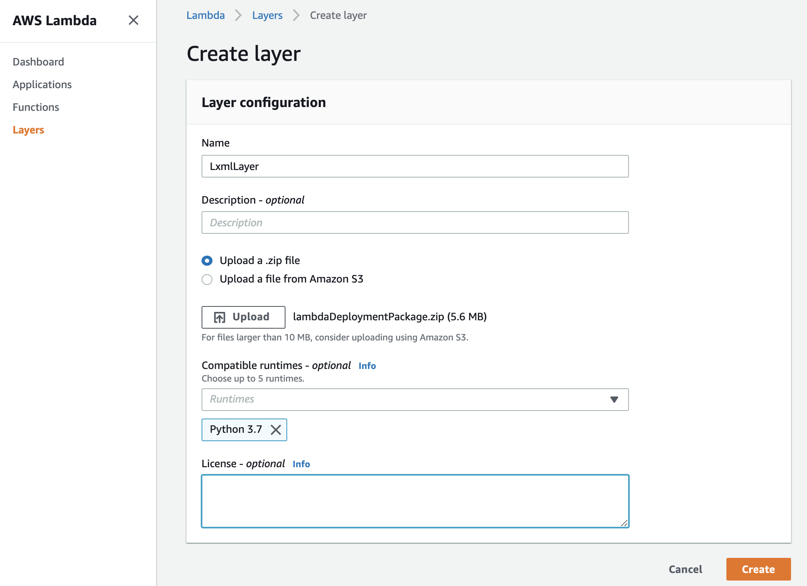
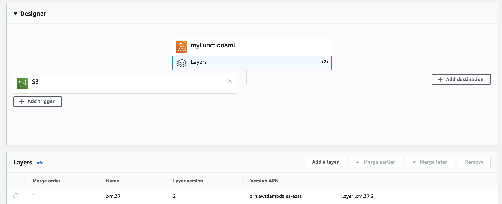

# Install LXML ETREE library in AWS Lambda
Below are the steps to install lxml etree library in AWS Lambda (python 3.7):

##1. Create Zip file for lxml in an EC2 instance [Alternatively, download [attached](./lambdaDeploymentPackage.zip) zip file]


```bash
sudo yum install python3 -y
curl -O https://bootstrap.pypa.io/get-pip.py
python3 get-pip.py --user
pip --version
mkdir deploy
cd deploy
mkdir -p python/lib/python3.7/site-packages
pip install lxml -t python/lib/python3.7/site-packages/.
chmod -R 755 .
zip -r9 lambdaDeploymentPackage.zip *
aws s3 cp lambdaDeploymentPackage.zip s3://xxxxxx/lambdaDeploymentPackage.zip
```

##2. Create a lambda layer to add above zip file with compatibility of python 3.7

##3. Create a lambda function to use above layer

```python
from lxml import etree
import pandas as pd
import awswrangler

def lambda_handler(event, context):
    args = {
```
##4. Test out! You should be good to go :)
